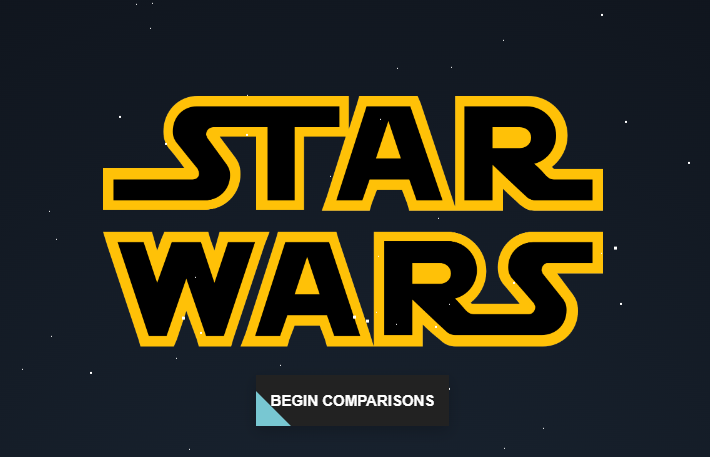
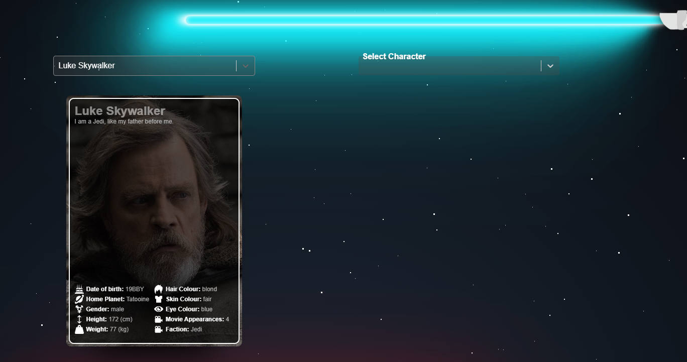
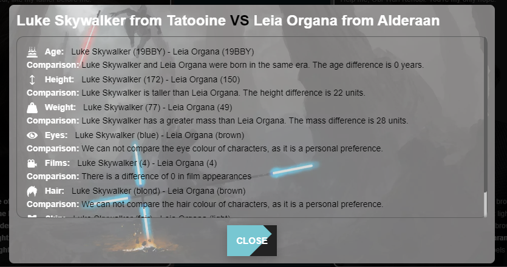

# Star Wars Character Comparison Tool (React Client)

This project is the **client** for the Star Wars Character Comparison Tool, built with **React** and **TypeScript**. The application allows users to compare two characters from the Star Wars universe by selecting them and viewing the comparison in an animated modal.

## Table of Contents

- [Installation](#installation)
- [Project Structure](#project-structure)
- [Features](#features)
- [Technologies Used](#technologies-used)
- [Running the Application](#running-the-application)
- [Screenshots](#screenshots)

## Installation

### Prerequisites

- **Node.js** version `20.18.0` or higher
- Ensure the **Server application** is running to fetch the character data.

### Steps

1. Clone this repository.

   git clone <https://github.com/JustinCPeel/SWAPI-Practise.git>

2. Navigate to the client folder.
   `cd client`

3. Install dependencies using npm.
   `npm install`

## Project Structure

The project is structured as follows:

```
root/
├── client/
│    ├── public/
│    └── src/
│    └── package.json
├── helper/
│    ├── downloads/
│    └── imageDownload.js
│    └── package.json
└── server/
    ├── src/
    │    ├── controllers/ 
    │    ├── dto/
    │    ├── routes/
    │    ├── services/
    │    └── tests
    └── package.json
```
## Features

- Character Comparison: Select two characters from the Star Wars universe and compare their attributes.
- Animated Transitions: Includes animated buttons and fading modal effects using Framer Motion.
- Responsive UI: Built with responsive design principles, ensuring compatibility across various screen sizes.
- Sass Support: Styling is written in Sass for modularity and reusability.

## Application Flow:

- Landing screen with an animated button.
- Selection of two Star Wars characters.
- Display of a comparison in a modal with animations.

## Technologies Used

- React 18
- React-Scripts
- TypeScript
- Axios for making API requests
- Framer Motion for animations
- React Select for dropdowns
- Sass for styling
- Jest and @testing-library for testing

## Running the Application && Available Scripts

- Make sure the Server application is up and running (necessary for character data).
  In the project directory, you can run:

### npm start

Runs the app in the development mode.\
Open [http://localhost:3000](http://localhost:3000) to view it in the browser.

The page will reload if you make edits.\
You will also see any lint errors in the console.

### npm test

Launches the test runner in the interactive watch mode.\
See the section about [running tests](https://facebook.github.io/create-react-app/docs/running-tests) for more information.

### npm run build

Builds the app for production to the build folder.\
It correctly bundles React in production mode and optimizes the build for the best performance.

The build is minified and the filenames include the hashes.\
Your app is ready to be deployed!


## Screenshots
### Landing Screen:
This is the initial page that is shown on startup:



### Character Select:
Screen for chosing 2 characters to use for comparison:


### Comparison:
Modal representation of the compared stats between the two characters:
